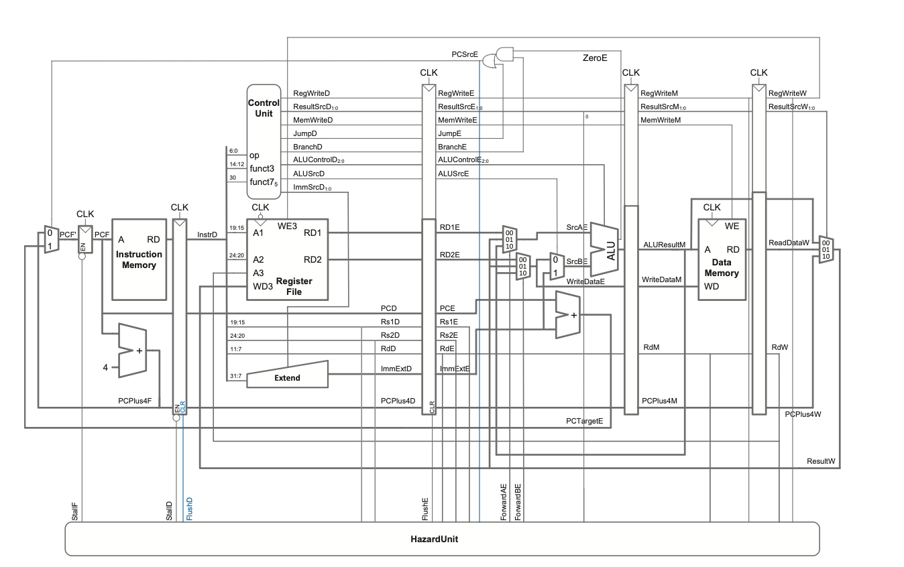

# Clock CPU simulator

## Target scheme and supported instructions

### Instructions

- `add (addi)` r1 r2 rd; rd = r1 + r2
- `sub` r1 r2 rd; rd = r1 - r2
- `and`, `or`, `slt`, `slti`
- `beq`, `jal`
- `sw`, `lw`; sw - store word in memory, lw - load word from memory

### Scheme



### Test load

Use `riscvtest.txt` source file to put binary instructions to be executed. This text will be read in instructions memory to infere cpu state.

```bash

cat riscvtest.txt:

00500113

00C00193

FF718393

...

0221A023

00210063

```

### To run

```bash

iverilog *.v
./a.out
gtkwave dump.vcd  #to investigate simulator internal state

```